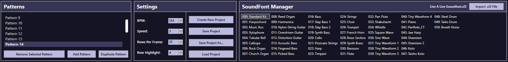
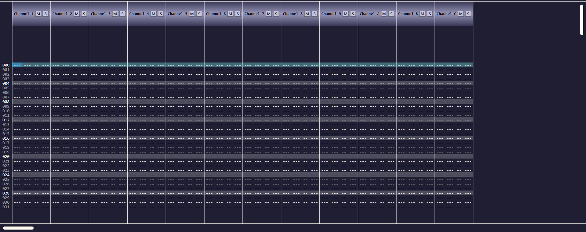

# sfTracker

`sfTracker` is a music tracker designed with *[FamiTracker](http://famitracker.com/)* as its main inspiration, created in C# using WPF and XAML for rendering visuals. It uses the [MeltySynth](https://github.com/sinshu/meltysynth) package for SoundFont integration, and [NAudio](https://github.com/naudio/naudio) for streaming audio playback.

## Settings Section

The above image shows the top portion of the sfTracker window. This features three distinct panels:

### Patterns
This panel shows the currently highlighted pattern/frame, with the options to:
  - Remove the currently selected pattern
  - Add a pattern at the current index
  - Remove the pattern at the current index.

*It should be noted that the scrollbar can only be moved using the scroll wheel.*

### Settings
This panel shows the song setup, as well as options for interacting with files/projects.
  - The **left column** includes the following settings which affect the current project:
    - **BPM** indicating the tempo (beats per minute) of the song.
      - Defaults to 120.
    - **Speed** influences the "tick" speed of the tracker (decreasing the value *increases* playback speed).
      - Defaults to 6. This value results in **absolute tempo**.
    - **Rows Per Frame** determines how many rows are in each pattern/frame.
      - Defaults to 32.
    - **Row Highlight** moves the highlighted row to different the desired interval.
      - Defaults to 4.

  - The **right column** includes the following buttons for file management:
    - **Create New Project** resets song settings and removes all note data.
    - **Save Project** saves all song data to a `.sft` file, opening a file explorer dialog if the project has not been saved before.
    - **Save Project As...** opens file explorer dialog and saves all data when confirmed.
    - **Load Project** allows `.sft` files to be loaded into the tracker.

    Each of these buttons triggers a confirmation dialog to ensure data is not unintentionally lost.

### SoundFont Manager
Shows all patches available in the currently loaded SoundFont. `MeltySynth` requires a file to be passed in to start the synthesiser, so the default SoundFont is `Kirby's_Dream_Land_3.sf2`, obtained from [William Kage's website](https://www.williamkage.com/snes_soundfonts/#kdl3_soundfont).

Each patch is mapped to digits starting from 0, with 0 being selected by default. Clicking a patch sets it as the selected instrument, resulting in any notes placed being mapped to that instrument.

Different SoundFonts can be loaded by clicking the `Import .sf2 File` button in the top-right. [Polyphone](https://www.polyphone.io/) can be used to edit and combine `.sf2` files, if desired.

## Tracker Section

The above image shows the bottom portion of the sfTracker window. This features the main tracker grid where notes are placed. There are **12** available channels, however the 10th channel (Channel A) is **reserved for percussion patches only** due to MIDI conventions.

### Channel Headers

Each channel has a header like the one shown above. This features clickable buttons to mute (M) or solo (S) the channel:
  - **Mute (M)** disables playback in the muted channel.
  - **Solo (S)** disables playback in every channel *except* the soloed channel.

### Channel Fields

Each channel has a set of **four** fields for placing and editing notes, as shown above.
- **Note**: In the format `pitch-octave`.
  - Notes are placed via keyboard input where `C-3` is the `Z` key `C-4` is the `Q` key. The remaining keybinds are mapped in the form of a standard piano.
  - Notes can be transposed using the following keybinds:
    - `'@` - transpose **down** one semitone
    - `#~` - transpose **up** one semitone
    - `[{` - transpose **down** one octave
    - `}]` - transpose **up** one octave
  - The horizontal bar represents a "stop", which is placed by pressing the `1` key.
- **Instrument**: 3-digit number corresponding to desired patch number from the SoundFont.
- **Volume/Velocity**: 2-digit number from 00 to 99 corresponding to desired note volume.
- **Effects**: one character for effect type followed by 2-digit number for effect severity.
  - sfTracker currently only supports panning which is formatted as `direction-value`, where `direction` is left or right (L/R) and `value` is a 2-digit number from 00 to 50.

`CTRL+Z` can be used to undo an action, and `CTRL+Y` can be used to redo an action. `BACKSPACE` and `DELETE` erase the selected field (and others in the same channel depending on the context).

Notes can only be placed and edited while edit mode is active, indicated by the currently highlighted row being magenta. To activate edit mode, press `SPACEBAR`. **Note that deletion of notes is possible outside of edit mode.**